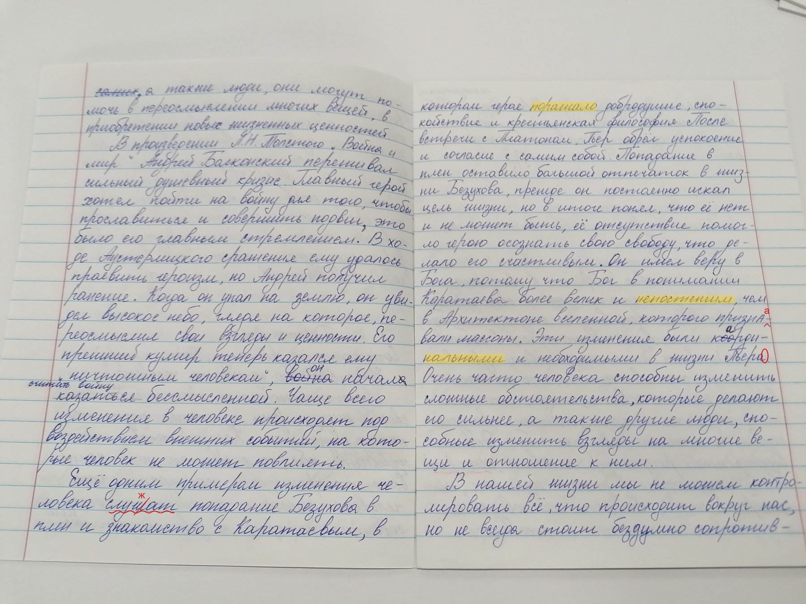

# BilimAI

AI-powered assignment grading assistant. Reads students' written work, checks it,
drafts grades and feedback — a teacher reviews and approves. Runs on a custom,
fully local AI (no cloud LLM APIs). Languages: **Russian and Uzbek**.

- [AGENTS.md](AGENTS.md) — start here (any agent or human): where things are, rules, environments.
- [ENGINEERING-LOG.md](ENGINEERING-LOG.md) — obstacles, fixes, decisions, results — append as you work.
- [plans/PLAN.md](plans/PLAN.md) — full tech stack, architecture, phased roadmap, risk register.
- [mvp/](mvp/) — single-file demo of the grading stage (typed text only).

## Where the reader stands (2026-08-19)

Sealed exam of real Russian school-notebook pages (60 pages, 2,569 handwritten lines, never trained on), scored with
[`eval/score.py`](eval/score.py) — **character error rate** (of 100 letters, how many wrong; lower is better) and **word accuracy**:

| reader | line CER (char-weighted) | word accuracy | lines read perfectly | end-to-end page CER (auto line detection) |
|---|---|---|---|---|
| GLM-OCR stock (no training) | 0.82 | 0.17 | 1 % | 0.68 |
| + LoRA v3 (language side only, 68 k lines) | 0.226 | 0.54 | 19 % | 0.293 |
| + LoRA v4 (+ HWR200 essays) | 0.222 | 0.57 | 20 % | 0.299 |
| **+ LoRA v5 (vision tower trained too, 290 k lines)** | **0.038** | **0.87** | **58 %** | **0.066** (was 0.113 before the detector fix of 2026-08-19; word accuracy end-to-end 0.83) |

The jump to v5 came from one change: training the half of the model that *looks* at the page, not only the half that
writes text. Numbers on text that never appears in training data are the same (0.038), so it is not memorisation.
The end-to-end column uses our own line detector (ReadingPipeline segmenter + measured box growth, [`bilimai/detector.py`](bilimai/detector.py)); the
remaining gap to human boxes is mostly 1–2-word fragments the detector does not fire on. Full leaderboard and method notes: [`eval/runs/README.md`](eval/runs/README.md).

### Fresh demo grading (v5)

Dictation-style check of a real pupil page against the dictated text: the reader transcribes each line, the dictation
engine compares with the key and draws marks; a teacher reviews.



12 marks on this page: **1 is the pupil's genuine misspelling** (*проевить → проявить*), one more is a misspelt name the
reader silently "corrected" (*Балконский*), the rest are places where the reader disagreed with the key — exactly what the
"needs teacher's attention" band is for. Request: [`contracts/examples/demo_v5/2921.json`](contracts/examples/demo_v5/2921.json);
line boxes are human boxes here (own line detector is next). Reproduce:
`python -m bilimai.pipeline --request contracts/examples/demo_v5/2921.json --out out/v5_demo --adapter models/adapters/glm-ocr-lora-ru-v5`.

## Run the MVP

```bash
# 1. Ollama serving + model
ollama serve &
ollama pull qwen3:8b

# 2. App
cd mvp
python3 -m venv .venv && .venv/bin/pip install -r requirements.txt
.venv/bin/uvicorn app:app --port 8000
```

Open http://localhost:8000 — "Load sample" cycles a Russian and an Uzbek essay.

Model is configurable: `BILIMAI_MODEL=qwen3:4b .venv/bin/uvicorn app:app --port 8000`.
